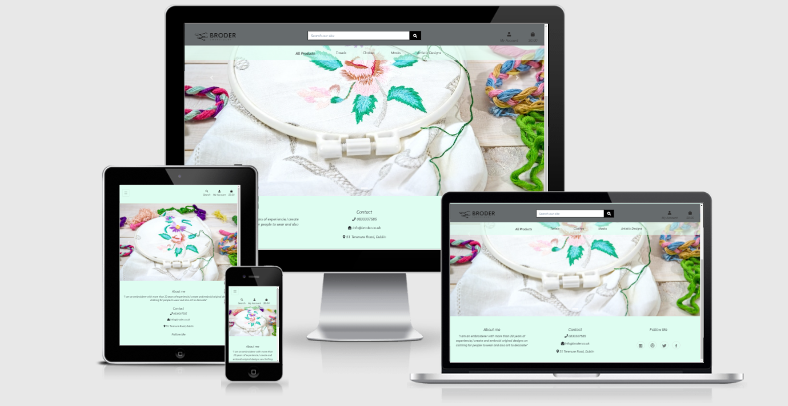
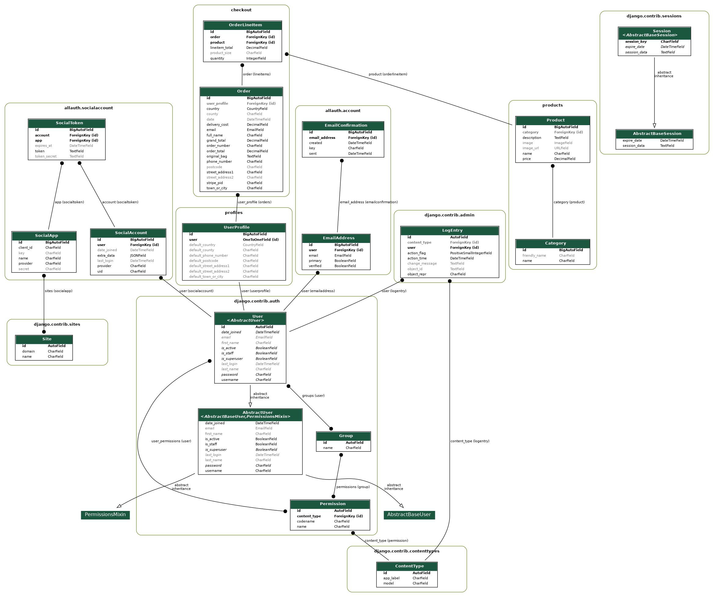

**Broder**

==================



# Table of Contents

* [General](#general)
* [User Stories](#user-stories)
* [Features](#Features)
* [WireFrames](#WireFrames)
* [Database Design](#database-design)

- [Technologies](#technologies)
 - [Testing](#testing)
     - Browser Compatibility
     - OS Compatibility
     - Devices Compatibility
     - W3 HTML Validation
     - W3 CSS Validation 
     - JSHint Validation
     - Python PEP8 Validation
     - User Testing
     - Bugs
 - [Deployment](#deployment)
 - [Credits](#credits)


## UX

## General

Broder is an e-commerce website built using Python and Django. 
The target audience of the site is anybody interested in Art and fashion as the artist of the site works on clothes
and also works of art.
The site is fully responsive on all modern screen sizes, and it allows a user to add and remove products
to a basket and buy them using stripe as payment method. This is for education purposes so for testing the 
checkout please use the following card number and details:

Card Number: 4242 4242 4242 4242
Month/Year : 04 / 24
CVC: 222
ZIP: 44444
The live site can be viewed [here](https://ms4-broder.herokuapp.com/).

### User Stories

As a first time user, I want:
- To quickly be able to understand the purpose of the website.
- To be able to register, sign in and sign out with ease.
- To navigate through the site and easily find the products I want.

As a returning visitor, I want:
- To sign in as easily as I did on my first visit and remain signed in if I 
choose to.
- To be able to reset my password.
- To be able to view all my purchases from my profile.
- To be able to save and update my details for future purchases.

As a frequent user, I want:
- To sign in and view my purchases.
- To add products to my basket and that they remain there for future purchase.
- To change some of my user details.

### User Journey

1. User's Journey starts at the homepage. 
1. They are presented with a carousel with picture that hints at what the site it’s about.
1. On the bottom they can see an “About” description, contact information and the social media icons to follow the artist's work.

### Design

- Colour Scheme
    - I used a friendly light emerald color scheme with a transparent option in some elements. Originally it was white but it felt a little traditional.
- Typography
    - I used 'Sarabun' as a font 
- Imagery
    - Most of the images were downloaded from pinterest with the idea of background either white or similar 

### Features

- The navigation menu will offer users a number of site locations depending on their user access. 
- Pay for products using Stripe.
- View products from the user personal account.
- Allauth user accounts.
- CRUD Functionality.
– Search bar to query the database of products.
– Displays shopper account details and order history   

### WireFrames

#### Home Page
[Home Wireframe](static/media/home.jpg)<br>
[Mobile Wireframe](static/media/Mobile.jpg)<br>
[Mobile Products](static/media/mobile_products.jpg)<br>
[Selected Products](static/media/selected_product.jpg)<br>
[Products](static/media/products.jpg)<br>


## Database Design

The final data schema was exported directly fom the Django model using django-extensions, pydot and GraphViz. The final data schema is shown below:



## Navigation

On the top in the middle there is a search bar that can be used to find all the products available on the website, the name of the site is on the left side and on the right side a user icon and a basket icon that shows the amount to spend for the selected products. The User Icon will display a profile option if the user is logged in if not, it will show a "login" or "register" option. The navbar has 5 categories "All products", "Towels", " Clothes", "Masks", "Artistic Designs" clicking on any of them will
take the user to the assigned category, if you select "All Products" a dropdown menu will appear which will give the option
to show all products available or if the user want to, show all products by price or by category.
Which ever category you select, once you see the products, above on the right you can order them by price, name or category.
In the middle of the main page there is a carousel of images with needles, threads, and embroidery equipment that makes it clear what the website is about. I used the name "Broder" which means embroidery in french. 
There is a "back to top" button at the bottom of the site for ease of navigation. 
The footer shows a little about artist description on the left in the middle the contact information, and on the right 
the social media icons if they want to follow the artists work.
The footer is visible on the entire website.

## Features

### Languages

- [HTML5](https://en.wikipedia.org/wiki/HTML5)

- [CSS3](https://en.wikipedia.org/wiki/CSS)

- [JavaScript](https://en.wikipedia.org/wiki/JavaScript)

- [Python](https://en.wikipedia.org/wiki/Python_(programming_language))


### Frameworks, Libraries & Programs Used

1. [Django](https://en.wikipedia.org/wiki/Django_%28web_framework%29) - Framework

1. [Amazon Web Services](https://en.wikipedia.org/wiki/Amazon_Web_Services) - Identity and Access Management & S3 (Media & Static Files)

1. [Allauth](https://django-allauth.readthedocs.io/en/latest/installation.html) - Django Authentication, Registration & Account Management

1. [Stripe](https://stripe.com/en-gb) - Payment API

1. [Bootstrap](https://getbootstrap.com/) - CSS Framework

1. [Heroku](https://en.wikipedia.org/wiki/Heroku) - Host Website

1. [Github](https://github.com/) - Repository Host

1. [Gitpod](https://www.gitpod.io/) - Development Environment

1. [Google Fonts](https://fonts.google.com/?query=Oswa) - Website Font

1. [Font Awesome](https://fontawesome.com/) - Icons

1. [Balsamiq](https://balsamiq.com/) - Wireframes- [Description](#description)

## Features Left to Implement

On one of the tabs I will like to add some pictures of the artist doing works from start to finish.
A wider descritpion of what the artist does, pictures and videos of his work on a different section.


Testing

Basic Testing
-------

1. All links on the website connect to the assigned location.
2. All images and elements on the website load correctly.
3. All elements on the website are responsive, resizing to different screens and maintaining their integrity.
4. The website loads correctly and functions on Chrome, Internet Explorer, Safari and Firefox browsers.
5. All browsers were tested on pc, mobile devices and tablets.
6. The website was tested by multiple users varied devices performed by family and friends and suggestions were made to improve
functionality and UX design, like color, access, ease to use.

## Security
All pages were tested with a non-admin account to check the access to the website. This was tested in several ways,
for example by copying the link to the admin profile when i was logged as admin and copying the link to an incognito
browser,  it displays a user and password to be able to do this. Login in as a normal user you dont see the option to edit
or delete content from the website as when you are logged as admin.

## Navbar Search Bar

Searching for a product on the site brings up relevant products. This was tested by using keywords for products, product categories or words in the description of the product, also an error message shown if the search query did not find any results.

### Home 
-	Carousel Images displayed, responsive on desktop and mobile views
-	Buttons on carousel images work correctly and switch automatically. Images are responsive to mobile
devices.
-	Footer on bottom displayed correctly, divided in 3 sections, about, contact and social media.

### Products
-	Product pages shows each category according to what is selected
-	Sort By option dropdown works correctly and has been tested for all options to make sure the the views are changed depending on the criteria selected
-	Category tag links, and edit/delete links for admins all work as intended.
-	If the image is clicked, the user is taken to that products individual detail page.

### Product Detail
-	Product images are all correct, along with the title and description of the product.
-	Product information is correctly shown to the user, such as price, description etc.
-	Edit/Delete links work only for admin.
-	Quantity selector works correctly, user can change the amount of the product using the up/down arrows within the box, at the sides of the box and by using the up/down arrow keys on the users keyboard.
-	Keep Shopping button hover works, and takes the user back to the products page
-	Add To Bag button adds the product to the users shopping bag. A pop up screen alert will appears with
any updates done on the product like changing the amount. A mini view of the users shopping bag will display
as well. This was tested with all the products of the website.
-	Below the add to bag button you can see the reviews, if you are logged in you can make a review, if you have
already done a review for the product the add review button is hidden, this was done with the idea to prevent users
to add more than one review. Reviews can also be seen without been logged in.
-	If form is not filled in correctly, a warning will show on the section of the form that is not correct. This was tested by leaving sections of the form blank and trying to submit. All input focus colours are correct

### Product Add/Edit
-	Removing an image works as intended
-	Adding an image works as intended
-	Add product button successfully adds a product to the site
-	Edit product button successfully amends the product information and/or image

### Shopping Bag
-	Product details are correctly displayed, "keep shopping" and "secure checkout" buttons displaying at the bottom right
-	Quantity selector works correctly and when the update button is clicked, the quantity updates
-	Subtotal updates based on quantity
-	Clicking the remove button removes the item successfully from the shopping bag, and updates the total cost of the shopping bag contents
-	Keep Shopping button sends the user back to the products page when clicked.
-	Secure Checkout button takes the user to the Checkout page, and correctly shows products that are in the shopping bag. This includes updated quantities.

### Checkout
-	Order Summary is correctly displayed, and shows the products that were in the shopping bag
-	Checkout form is correctly displayed to the user
-	If the user is logged in, checkbox is displayed for the user to save this address to their profile. If they click this checkbox and the order is completed, the delivery details are added to the profile page
-	If user is not logged in, as long as they provide all the required fields the purchase can be done.
-	I have tested this by creating new accounts, checking this box and checking the profile page after completing the order
-	Stripe default card number used for payments. No payment issues found
-	If incorrect card details are entered, an error is displayed to the user
-	If part of the form is left empty the order will not process and takes the user to the empty section of the form
-	Complete Order Securely button works and processes the order and payment for the user.

### Register
-	Register page allows a user to register an account using their email address
-	It will then send the user an email to confirm their email address and complete the registration process
-	Once the user has confirmed their email, they can log in and use the site as a registered user
-	I have tested this by creating accounts with different email addresses, all worked as predicted

### Sign In
-	User can sign in using the email address or username they signed up with and the password they chose
-	A checkbox can be ticked that will save the users information for future visits
-	If a user has forgotten their password, the option is there for them to click it, and run through the forgotten password journey that allows them to reset it. This has been tested with multiple accounts and works
-	If no user exists with those details, an error will display above the log in form to inform the user of that

### Profile
-	Order history display is correct and shows all past orders
-	If the order number is clicked, the user can see all the information in that order
-	Default Delivery Information form works as intended, and auto-fills if it has been selected in the checkout process
-	Updating the address works correctly, and is reflected both on the profile page and the checkout

## First Time Users

*To quickly be able to understand the purpose of the website*
-	Users are shown an "About me" in the home page, images in the carousel and social media links on the footer 

*To be able to register, sign in and sign out with ease.*
-   The user icon is on the top right, login and register option appear when you click on it.

*To navigate through the site and easily find the products I want.*
-	The Navbar shows all categories you can browse without having to register, and aslo there is a search bar
to look for something specific. 

## Returning Users

*To sign in as easily as I did on my first visit and remember my credentials*
-  There is a check box to "remember sign in" after first logon.

*To be able to reset my password.*
-  If you forgot your password you can just click forgot password and type your email and a reset link will be sent to your account.

*To be able to view all my purchases from my profile.*
-  When a user is logged in, if they navigate to their user profile page they will be able to see their order history.
They can click on the purchase order and they will see a detailed description of the orther.

*To be able to save and update my details for future purchases*
-  On the user profile they have the hability to save and update their personal information.


OS the site was tested on:
- Mac OS 11.6
- Windows 10
- Android (OxygenOS Version 9.0.6)
- iOS 14.4.1

----
**Device Compatibility** 

The devices used during testing were: 
- MacBook Air
- Dell Inspiron
- OnePlus 6t
- iPhone X 
- iPhone SE 
- HP Elitebook G5 
- iPad 10.2
- Samsung Galaxy s20
- Xiaomi MIA3


----
**W3 HTML Validation** 

HTML Validation with [https://validator.w3.org/](https://validator.w3.org/).


----
**W3C CSS Validation** 

CSS validation with [https://jigsaw.w3.org/css-validator/](https://jigsaw.w3.org/css-validator/)

----
**JSLint Javascript Validation** 

Javascript validated via https://www.jslint.com/


**Results**


I was not able to fix this Html error, tried to look for it in Slack or with the tutors
and they couldnt help either, so I want to add to my README file.


**Bugs**

+ **Bug-01:** checkout migrations error -  It was working because the migration file was trying to remove a field named sku from one of the previous migrations, I had to delete those lines and run the migrations again,  I had to backup my database in case the migration failed with the dumpdata command.  

+ **Bug-02:** Change category error - I updated one category from the admin panel but the link on the navbar will not redirect,this was because the URL was not updated with the same name as the category, it had the old name.

+ **Bug-03:** Some images were not loading after heroku deployment even after been uploaded to aws correctly so i changed the path in gitpod to the aws bucket path were the images were uploaded and that fixed the issue.

+ **Bug-04:** Heroku deployment error after installing django extensions, this was because i forgot to freeze the requirements, after i freeze the requirements and redeploy to heroku there were no errors. 

+ **Bug-05:** I had a 500 error when accessing a product when the site was already deployed in heroku,
 there was a problem with my database so I had to back up my data ,reset the database from heroku, load it again and run migrations to fix it. 


----

Deployment
----------

To deploy this project you will need to set up accounts with the following services.

- [Github](https://github.com/)     
- [Gitpod](https://gitpod.io/)   
- [Stripe](https://stripe.com/en-ie)   
- [AWS](https://aws.amazon.com/)   
- [Heroku](https://www.heroku.com/)    


### Deployment to Heroku  

1. **Create a Heroku App**
    1. Create a new app by clicking the ‘New’ button.
    2. Give a unique name and set region to your nearest region.
    3. Click ‘Create App’.
    4. Click on the 'Resources' tab, in Add-ons type: postgress and choose 'Heroku Postgres'.
    5. For plan name choose the free plan and click submit form.

2. **Setup the Postgres Database**
    1. In your IDE install dj_database_url and psycopg2.   
        ```
        pip3 install dj_database_url
        pip3 install psycopg2-binary
        ```
    2. Create a requirements file.  
        ```
        pip3 freeze > requirements.txt
        ```
    3. Import dj_database_url in `settings.py`.
    4. Backup the database if you're using a local database instead of fixtures.  
        ```
        python3 manage.py dumpdata --exclude auth.permission --exclude contenttypes > db.json
        ```  
        p.s. make sure you're connected to your mysql database.  
    5. Scroll down to DATABASES, comment out the default configuration and add the database url from Heroku   
        ```
        DATABASES = {
                'default': dj_database_url.parse('DATABASE_URL')
        }
        ```
        You can the database url from Heroku's Config Vars in the Settings tab. 
        > Note: The DATABASE_URL from Heroku is an environment variable and shouldn't be committed in version control.
    6. Run migrations.  
          ```
          python3 manage.py migrate
          ```
    7. In case of using a local database type:  
        ```
        python3 manage.py loaddata db.json
        ```  
        to import the data from the mySQL database to Postgre.
    8. In case of using fixtures:  
        First import the categories:  
        ```
        python3 manage.py loaddata categories
        ```  
        And then the products:  
        ```
        python3 manage.py loaddata products
        ```  
    
3. **Create a superuser**  
    - Type: `python3 manage.py createsuperuser`  
    - Add a username and password.

4. **Make a distinction between local and remote database**  
    Create an if-statement in `settings.py` so that when the app is running on Heroku it connects to Postgres(remote) and otherwise, it connects to sequel light(local).  
    ```
    if 'DATABASE_URL' in os.environ:
        DATABASES = {
            'default': dj_database_url.parse(os.environ.get('DATABASE_URL'))
        }
    else:
        DATABASES = {
            'default': {
                'ENGINE': 'django.db.backends.sqlite3',
                'NAME': BASE_DIR / 'db.sqlite3',
            }
        }
    ```
5. **Install gunicorn**  
    Gunicorn will replace the development server once the app is deployed to Heroku and will act as the web server.  
    type: `pip3 install gunicorn`

6. **Create a Heroku 'Procfile'**  
    The Procfile is what Heroku looks for to know which file runs the app and how to run it.
    1. In the terminal type: **touch Procfile** or create a new file named 'Procfile' in the root.
    2. Inside the Procfile type:   
    ```
    web: gunicorn <Github appname>.wsgi:application
    ```

7. **Connect to Heroku in the terminal**
    1. Login to your account on the Heroku website.
    2. Go to account settings (click on your avatar).
    3. Scroll down to the API Key section.
    4. Click 'Reveal' and copy your API Key.
    5. Login to Heroku via CLI  
     ```
     heroku login -i
     ```
    6. Login with your email but use the API Key as the password.
    7. Temporarily disable the collection of static files until AWS has been setup.  
        ```
        heroku config:set DISABLE_COLLECTSTATIC=1 --app <Heroku appname>
        ```  
    8. Add the hostnames to allowed hosts in `settings.py`.  
        ```
        ALLOWED_HOSTS = ['<heroku appname>.herokuapp.com', 'localhost', '127.0.0.1']
        ```
       where 127.0.0.1 is the IP of the localhost, so that the app can also run locally.
    9. Commit to GitHub.
    10. Commit to Heroku. Make sure you have git remote initialized.  
        ```
        heroku git:remote -a <Heroku appname>
        ```  
        Push to Heroku.  
        ```
        git push heroku
        ```

8. **Setup automatic deployment from GitHub/Connect Heroku app to GitHub.**  
    1. Go to the Deploy tab.  
    2. Under 'Deployment method', Click on 'Connect to GitHub'.
    3. Under 'Connect to GitHub', enter the GitHub repository name and click ‘Search’ and click 'Connect'.
    4. Scroll down to Automatic deploys and click the ‘Enable Automatic Deploys’ button.  

    ### Forking this GitHub Repository
A fork is a copy of a repository. Forking a repository allows you to freely experiment with changes without affecting the original project.
To achieve this follow these steps:
1. Login to GitHub and follow this link to [the GitHub Repository](https://github.com/Federvgh/ms4-broder).
2. At the top right of the page, click on the fork button.  
3. You now have a copy of the repository in your GitHub account.

### Cloning this GitHub repository
1. Log in to GitHub and follow this link to 
2. Click on the ‘Code’ button 
3. To clone using HTTPS, copy the link that is displayed by clicking on the copy icon 
4. Open a terminal in your preferred IDE (e.g. VSCode or Atom)
5. Use  the ‘git clone’ command and add the link that you copied in step 3.
6. Or for VSCode: click 'Explorer' or 'Shift + CMD + E'. 
7. Click the button 'Clone Repository', add the url you copied above and hit enter.
8. A clone will be created locally.

> For more info on how to clone a repository check [here](https://docs.github.com/en/free-pro-team@latest/github/creating-cloning-and-archiving-repositories/cloning-a-repository)

### Setup local deployment

2. **Install the requirements by typing:**  
        ```
        pip3 install -r requirements.txt
        ```  
   in the terminal.
3. **Set the environment variables.**
    1. If you're using GitPod.
        - In your workspace click 'Settings'.
        - In Environment Variables insert the following variables:
        ```
        'DEVELOPMENT', 'True'
        'SECRET_KEY', '<your secret key>'  e.g. from a key generator
        'STRIPE_PUBLIC_KEY', '<your stripe public key>'
        'STRIPE_SECRET_KEY', '<your stripe secret key>'
        'STRIPE_WH_SECRET', '<your stripe webhook secret>'
        ```
    2. If you're using a local IDE, like VSCode.
        - Create a .gitignore file in the root directory, if there isn't one.
        - Open the .gitignore file and add 'env.py' to it, if it isn't in there. 
        - Create an env.py file and set the environment variables by adding the following text: 
        ```
            import os

            os.environ["STRIPE_PUBLIC_KEY"] = '<your stripe public key>'
            os.environ["STRIPE_SECRET_KEY"] = '<your stripe secret key>'
            os.environ["STRIPE_WH_SECRET"] = '<your stripe webhook secret>'

            os.environ["SECRET_KEY"] = '<your secret key>'  e.g. from a key generator

            os.environ["DEVELOPMENT"] = 'True'
        ```  
    > Tip: use this [key generator](https://miniwebtool.com/django-secret-key-generator/)  

4. **Migrate the database models**
    - Check migrations
    ```
    python3 manage.py makemigrations --dry-run
    ```
    - Make migrations
    ```
    python3 manage.py makemigrations
    ```
    - Check migrate
    ```
    python3 manage.py migrate --plan
    ```
    - Migrate
    ```
    python3 manage.py migrate
    ```

5. **Load product data.**
    - Type `python3 manage.py loaddata db.json`
6. **Create a superuser account**
    - `python3 manage.py createsuperuser`
    - Add a username and password.   
7.**Run the app.**
   - In the terminal, type: `python3 <your python file name>.py`  

   **Setup Stripe**
    1. Add Stripe keys to Config Var
        - Login to Stripe or create and [account](https://dashboard.stripe.com/register).
        - Click developers and then API Keys.
        - Copy the public and secret key and add them to Config Vars in Heroku.  
        ```
        STRIPE_PUBLIC_KEY = <your Stripe public key>
        STRIPE_SECRET_KEY = <your Stripe secret key>
        ```  
    2. Create a webhook endpoint
        - In Stripe - Developers click 'webhooks'.
        - Click 'Add endpoint'.
        - Enter your heroku url and add /checkout/wh/ to it.
        ```
        https://<projectname>.herokuapp.com/checkout/wh/
        ```  
        - Select 'receive all events' and click 'Add endpoint.
        - Scroll down to 'Signing secret' and click 'Reveal signing secret'.
        - Copy the signing secret and add to the Config Vars in Heroku.


Credits
-------

Back to top smooth button idea from link below:
https://mdbootstrap.com/snippets/standard/mdbootstrap/2964350#css-tab-view
https://moderncss.dev/pure-css-smooth-scroll-back-to-top/

I took color ideas for the site from the link below
https://visme.co/blog/website-color-schemes/

The deploymnet tutorial for heroku it was thoroughly explained in the below project so I copied it from there
https://github.com/chizzletaz/SpaceTravelAgency

The footer idea was taking from here
https://epicbootstrap.com/snippets/footer-basic

The review idea was based on a project from the below youtube channel
https://www.youtube.com/playlist?list=PLgnySyq8qZmrxJvJbZC1eb7PD4bu0a-sB

Carousel idea was taken from boostrap

I took the project boutique as an example to create my website.

Stackoverflow and slack comunity for general queries

I will like to thank the support of my mentor Antonio rodriguez and all tutors in Code institute
for their invaluable input.
