**Broder**

==================


# Table of Contents

* [General](#general)
* [User Stories](#user-stories)
* [Features](#Features)
* [WireFrames](#WireFrames)
* [Database Design](#database-design)

- [Technologies](#technologies)
 - [Testing](#testing)
     - Browser Compatibility
     - OS Compatibility
     - Devices Compatibility
     - W3 HTML Validation
     - W3 CSS Validation 
     - CSS Lint Validation 
     - JSHint Validation
     - Python PEP8 Validation
     - User Testing
     - Bugs
 - [Deployment](#deployment)
 - [Credits](#credits)
     - Code Used
     - Acknowledgements

## UX

## General

Broder is an e-commerce website built using Python and Django. 
The site is fully responsive on all modern screen sizes, and it allows a user to add and remove products
to a basket and buy them using stripe as payment method. This is for education purposes so the credit card is
not linked to a bank account, you can use 4242 4242 42424 4242 and any cvc to test and you will receive an email
with the "fake" purchase details.
The live site can be viewed [here](https://ms4-broder.herokuapp.com/).

### User Stories

As a first time user, I want:
- To quickly be able to understand the purpose of the website.
- To be able to register, sign in and sign out with ease.
- To navigate through the site and easily find the products I want.

As a returning visitor, I want:
- To sign in as easily as I did on my first visit and remain signed in if I 
choose to.
- To be able to reset my password.
- To be able to view all my purchases from my profile.
- To be able to save my details for future purchases.

As a frequent user, I want:
- To sign in and view my purchases.
- To add products to my basket and that they remain there for future purchase.
- To change some of my user details.

### User Journey

1. User's Journey starts at the homepage. 
1. They are presented with a picture hat hints at what the site it’s about.
1. On the bottom they can see and “About” description

### Design

- Colour Scheme
    - I used a friendly light emerald color scheme with a transparent option in some elements. Originally it was white but it felt a little traditional.
- Typography
    - I used 'Sarabun' as a font 
- Imagery
    - Most of the images were downloaded from pinterest with the idea of background ion white or similar 

### Features

- The navigation menu will offer users a number of site locations depending on their user access. 
- Pay for products using Stripe.
- View products from the user personal account.
- Allauth user accounts.
- CRUD Functionality.
– Search bar to query the database of products.
– Displays shopper account details and order history   

### WireFrames

#### Home Page
[Home Wireframe](static/media/home.jpg)<br>
[Mobile Wireframe](static/media/Mobile.jpg)<br>
[Mobile Products](static/media/mobile_products.jpg)<br>
[Selected Products](static/media/selected_product.jpg)<br>
[Products](static/media/products.jpg)<br>


## Database Design

This database uses a SQL database through PostgreSQL. They were originally built in JSON files.

### Categories Database

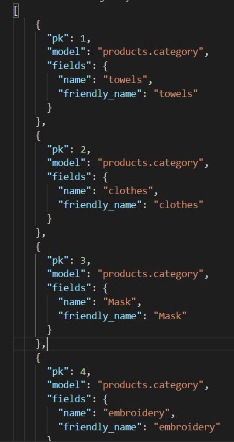

### Products Database

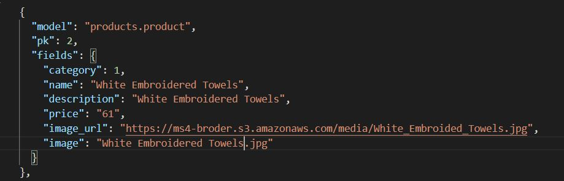

## Navigation

The navbar at the top of the page has search element in the middle, a logo on the left side
and on the right side a user icon and a basket icon that shows the amount to spend for the selceted products. 
The User Icon will display a profile option if the user is logged in if not, it will show a "login" or "register" option
In the body of the page there is an image that suggest what the website is about, and the title or "brand" of the website
is "Broder" which means embroidery in french.
The footer shows a little about artist description on the right and a short text on the left of what the site provides.
The footer is only visible in the index page, this was made on purpose to make the website more user friendly for purchases.

## Features Left to Implement

I would have liked to have a logo, I didn’t have time to design it.
On one of the tabs I will like to add some pictures of the artist doing works from start to finish.
A wider descritpion of what the artist does how to contact her, pictures and videos of his work on a different section.

## Technologies

### Languages

- [HTML5](https://en.wikipedia.org/wiki/HTML5)

- [CSS3](https://en.wikipedia.org/wiki/CSS)

- [JavaScript](https://en.wikipedia.org/wiki/JavaScript)

- [Python](https://en.wikipedia.org/wiki/Python_(programming_language))


### Frameworks, Libraries & Programs Used

1. [Django](https://en.wikipedia.org/wiki/Django_%28web_framework%29) - Framework

1. [Amazon Web Services](https://en.wikipedia.org/wiki/Amazon_Web_Services) - Identity and Access Management & S3 (Media & Static Files)

1. [Allauth](https://django-allauth.readthedocs.io/en/latest/installation.html) - Django Authentication, Registration & Account Management

1. [Stripe](https://stripe.com/en-gb) - Payment API

1. [Bootstrap](https://getbootstrap.com/) - CSS Framework

1. [Heroku](https://en.wikipedia.org/wiki/Heroku) - Host Website

1. [Github](https://github.com/) - Repository Host

1. [Gitpod](https://www.gitpod.io/) - Development Environment

1. [Google Fonts](https://fonts.google.com/?query=Oswa) - Website Font

1. [Font Awesome](https://fontawesome.com/) - Icons

1. [Balsamiq](https://balsamiq.com/) - Wireframes- [Description](#description)


Testing
-------

1. All links on the website connect to the assigned location.
2. All images and elements on the website load correctly.
3. All elements on the website are responsive, resizing to different screens and maintaining their integrity.
4. The website loads correctly and functions on Chrome, Internet Explorer, Safari and Firefox browsers.
5. All browsers were tested on pc, mobile devices and tablets.
6. The website was tested by multiple users varied devices performed by family and friends and suggestions were made to improve
functionality and UX design, like color, access, ease to use.


OS the site was tested on:
- Mac OS 11.6
- Windows 10
- Android (OxygenOS Version 9.0.6)
- iOS 14.4.1

----
**Device Compatibility** 

The devices used during testing were: 
- MacBook Air
- Dell Inspiron
- OnePlus 6t
- iPhone X 
- iPhone SE 
- HP Elitebook G5 
- iPad 10.2
- Samsung Galaxy s20
- Xiaomi MIA3


----
**W3 HTML Validation** 

HTML Validation with [https://validator.w3.org/](https://validator.w3.org/).


----
**W3C CSS Validation** 

CSS validation with [https://jigsaw.w3.org/css-validator/](https://jigsaw.w3.org/css-validator/)

----
**JSLint Javascript Validation** 

Javascript validated via https://www.jslint.com/


**Results**
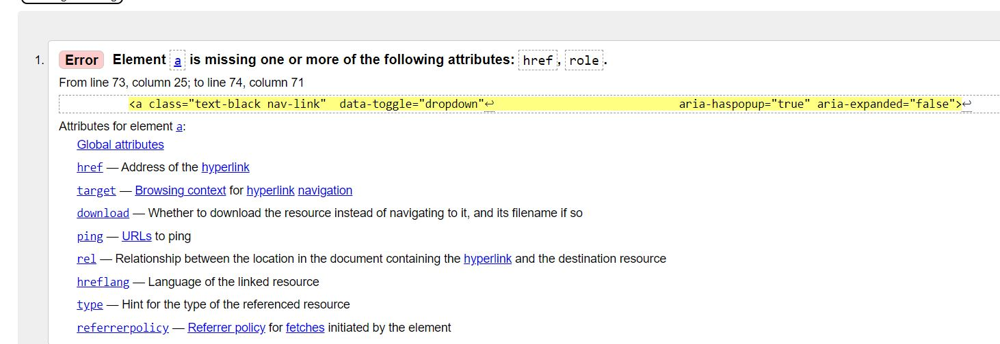

I was not able to fix this Html error, tried to look for it in Slack or with the tutors in Code Institute
and they couldnt help either, so I want to add to my README file.

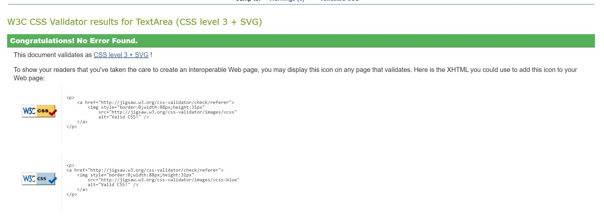


----

Deployment
----------

To deploy this project you will need to set up accounts with the following services.

- [Github](https://github.com/)     
- [Gitpod](https://gitpod.io/)   
- [Stripe](https://stripe.com/en-ie)   
- [AWS](https://aws.amazon.com/)   
- [Heroku](https://www.heroku.com/)    


### Deployment to Heroku  

1. **Create a Heroku App**
    1. Create a new app by clicking the ‘New’ button.
    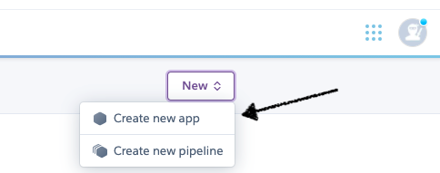
    2. Give a unique name and set region to your nearest region.
    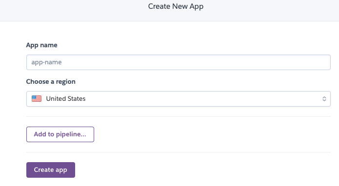
    3. Click ‘Create App’.
    4. Click on the 'Resources' tab, in Add-ons type: postgress and choose 'Heroku Postgres'.
    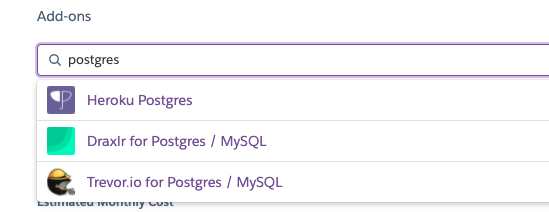  
    5. For plan name choose the free plan and click submit form.

2. **Setup the Postgres Database**
    1. In your IDE install dj_database_url and psycopg2.   
        ```
        pip3 install dj_database_url
        pip3 install psycopg2-binary
        ```
    2. Create a requirements file.  
        ```
        pip3 freeze > requirements.txt
        ```
    3. Import dj_database_url in `settings.py`.
    4. Backup the database if you're using a local database instead of fixtures.  
        ```
        python3 manage.py dumpdata --exclude auth.permission --exclude contenttypes > db.json
        ```  
        p.s. make sure you're connected to your mysql database.  
    5. Scroll down to DATABASES, comment out the default configuration and add the database url from Heroku   
        ```
        DATABASES = {
                'default': dj_database_url.parse('DATABASE_URL')
        }
        ```
        You can the database url from Heroku's Config Vars in the Settings tab. 
        > Note: The DATABASE_URL from Heroku is an environment variable and shouldn't be committed in version control.
    6. Run migrations.  
          ```
          python3 manage.py migrate
          ```
    7. In case of using a local database type:  
        ```
        python3 manage.py loaddata db.json
        ```  
        to import the data from the mySQL database to Postgre.
    8. In case of using fixtures:  
        First import the categories:  
        ```
        python3 manage.py loaddata categories
        ```  
        And then the products:  
        ```
        python3 manage.py loaddata products
        ```  
    
3. **Create a superuser**  
    - Type: `python3 manage.py createsuperuser`  
    - Add a username and password.

4. **Make a distinction between local and remote database**  
    Create an if-statement in `settings.py` so that when the app is running on Heroku it connects to Postgres(remote) and otherwise, it connects to sequel light(local).  
    ```
    if 'DATABASE_URL' in os.environ:
        DATABASES = {
            'default': dj_database_url.parse(os.environ.get('DATABASE_URL'))
        }
    else:
        DATABASES = {
            'default': {
                'ENGINE': 'django.db.backends.sqlite3',
                'NAME': BASE_DIR / 'db.sqlite3',
            }
        }
    ```
5. **Install gunicorn**  
    Gunicorn will replace the development server once the app is deployed to Heroku and will act as the web server.  
    type: `pip3 install gunicorn`

6. **Create a Heroku 'Procfile'**  
    The Procfile is what Heroku looks for to know which file runs the app and how to run it.
    1. In the terminal type: **touch Procfile** or create a new file named 'Procfile' in the root.
    2. Inside the Procfile type:   
    ```
    web: gunicorn <Github appname>.wsgi:application
    ```

7. **Connect to Heroku in the terminal**
    1. Login to your account on the Heroku website.
    2. Go to account settings (click on your avatar).
    3. Scroll down to the API Key section.
    4. Click 'Reveal' and copy your API Key.
    5. Login to Heroku via CLI  
     ```
     heroku login -i
     ```
    6. Login with your email but use the API Key as the password.
    7. Temporarily disable the collection of static files until AWS has been setup.  
        ```
        heroku config:set DISABLE_COLLECTSTATIC=1 --app <Heroku appname>
        ```  
    8. Add the hostnames to allowed hosts in `settings.py`.  
        ```
        ALLOWED_HOSTS = ['<heroku appname>.herokuapp.com', 'localhost', '127.0.0.1']
        ```
       where 127.0.0.1 is the IP of the localhost, so that the app can also run locally.
    9. Commit to GitHub.
    10. Commit to Heroku. Make sure you have git remote initialized.  
        ```
        heroku git:remote -a <Heroku appname>
        ```  
        Push to Heroku.  
        ```
        git push heroku
        ```

8. **Setup automatic deployment from GitHub/Connect Heroku app to GitHub.**  
    1. Go to the Deploy tab.  
    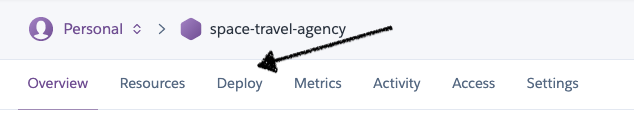  
    2. Under 'Deployment method', Click on 'Connect to GitHub'.
    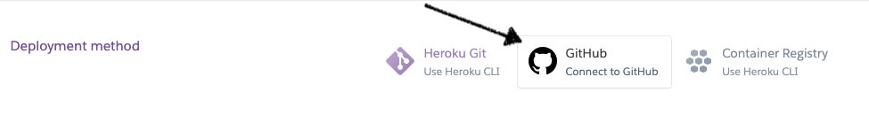
    3. Under 'Connect to GitHub', enter the GitHub repository name and click ‘Search’ and click 'Connect'.
    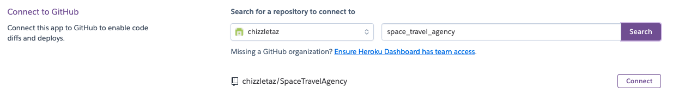
    4. Scroll down to Automatic deploys and click the ‘Enable Automatic Deploys’ button.  
    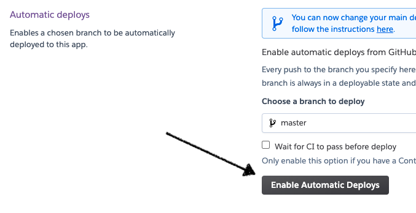

    ### Forking this GitHub Repository
A fork is a copy of a repository. Forking a repository allows you to freely experiment with changes without affecting the original project.
To achieve this follow these steps:
1. Login to GitHub and follow this link to [the GitHub Repository](https://github.com/Federvgh/ms4-broder).
2. At the top right of the page, click on the fork button.  
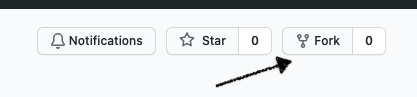
3. You now have a copy of the repository in your GitHub account.

### Cloning this GitHub repository
1. Log in to GitHub and follow this link to [the GitHub Repository](https://github.com/Federvgh/ms4-broder)
2. Click on the ‘Code’ button 
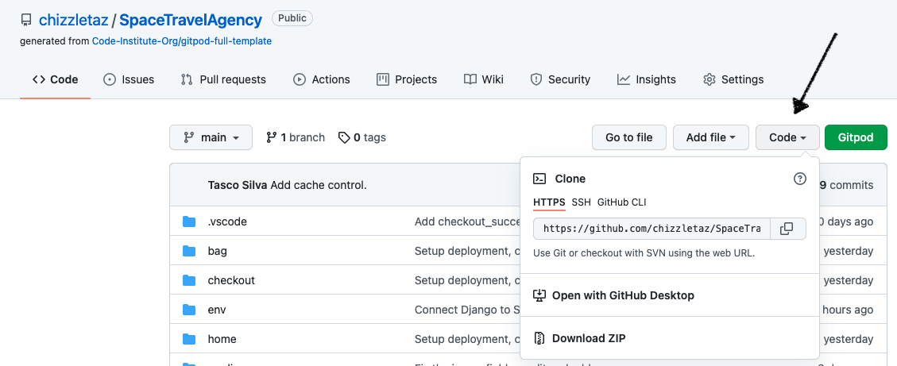
3. To clone using HTTPS, copy the link that is displayed by clicking on the copy icon 
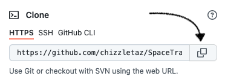.
4. Open a terminal in your preferred IDE (e.g. VSCode or Atom)
5. Use  the ‘git clone’ command and add the link that you copied in step 3.
6. Or for VSCode: click 'Explorer' or 'Shift + CMD + E'. 
7. Click the button 'Clone Repository', add the url you copied above and hit enter.
8. A clone will be created locally.

> For more info on how to clone a repository check [here](https://docs.github.com/en/free-pro-team@latest/github/creating-cloning-and-archiving-repositories/cloning-a-repository)

### Setup local deployment

2. **Install the requirements by typing:**  
        ```
        pip3 install -r requirements.txt
        ```  
   in the terminal.
3. **Set the environment variables.**
    1. If you're using GitPod.
        - In your workspace click 'Settings'.
        - In Environment Variables insert the following variables:
        ```
        'DEVELOPMENT', 'True'
        'SECRET_KEY', '<your secret key>'  e.g. from a key generator
        'STRIPE_PUBLIC_KEY', '<your stripe public key>'
        'STRIPE_SECRET_KEY', '<your stripe secret key>'
        'STRIPE_WH_SECRET', '<your stripe webhook secret>'
        ```
    2. If you're using a local IDE, like VSCode.
        - Create a .gitignore file in the root directory, if there isn't one.
        - Open the .gitignore file and add 'env.py' to it, if it isn't in there. 
        - Create an env.py file and set the environment variables by adding the following text: 
        ```
            import os

            os.environ["STRIPE_PUBLIC_KEY"] = '<your stripe public key>'
            os.environ["STRIPE_SECRET_KEY"] = '<your stripe secret key>'
            os.environ["STRIPE_WH_SECRET"] = '<your stripe webhook secret>'

            os.environ["SECRET_KEY"] = '<your secret key>'  e.g. from a key generator

            os.environ["DEVELOPMENT"] = 'True'
        ```  
    > See [above](#setup-stripe) how to get your stripe keys.  
    > Tip: use this [key generator](https://miniwebtool.com/django-secret-key-generator/)  

4. **Migrate the database models**
    - Check migrations
    ```
    python3 manage.py makemigrations --dry-run
    ```
    - Make migrations
    ```
    python3 manage.py makemigrations
    ```
    - Check migrate
    ```
    python3 manage.py migrate --plan
    ```
    - Migrate
    ```
    python3 manage.py migrate
    ```

5. **Load product data.**
    - Type `python3 manage.py loaddata db.json`
6. **Create a superuser account**
    - `python3 manage.py createsuperuser`
    - Add a username and password.   
7.**Run the app.**
   - In the terminal, type: `python3 <your python file name>.py`  

   **Setup Stripe**
    1. Add Stripe keys to Config Var
        - Login to Stripe or create and [account](https://dashboard.stripe.com/register).
        - Click developers and then API Keys.
        - Copy the public and secret key and add them to Config Vars in Heroku.  
        ```
        STRIPE_PUBLIC_KEY = <your Stripe public key>
        STRIPE_SECRET_KEY = <your Stripe secret key>
        ```  
    2. Create a webhook endpoint
        - In Stripe - Developers click 'webhooks'.
        - Click 'Add endpoint'.
        - Enter your heroku url and add /checkout/wh/ to it.
        ```
        https://<projectname>.herokuapp.com/checkout/wh/
        ```  
        - Select 'receive all events' and click 'Add endpoint.
        - Scroll down to 'Signing secret' and click 'Reveal signing secret'.
        - Copy the signing secret and add to the Config Vars in Heroku.

**Bugs**

+ **Bug-01:** checkout migrations error -  It was working because the migration file was trying to remove a field named sku from one of the previous migrations, I had to delete those lines and run the migrations again,  I had to backup my database in case the migration failed with the dumpdata command.  

+ **Bug-02:** Change category error - I updated one category from the admin panel but the link on the navbar will not redirect,this was because the URL was not updated with the same name as the category, it had the old name.


Acknoweledments
-------

**Code used**

Back to top smooth button idea from link below:
https://mdbootstrap.com/snippets/standard/mdbootstrap/2964350#css-tab-view
https://moderncss.dev/pure-css-smooth-scroll-back-to-top/

I took color ideas for the site from the link below
https://visme.co/blog/website-color-schemes/

The deploymnet tutorial for heroku it was thoroughly explained in the below project so I copied it from there
https://github.com/chizzletaz/SpaceTravelAgency

I took the project boutique as an example to create my website.

Stackoverflow and slack comunity for general queries

I will like to thank the support of my mentor Antonio rodriguez and all tutors in Code institute
for their invaluable input.
